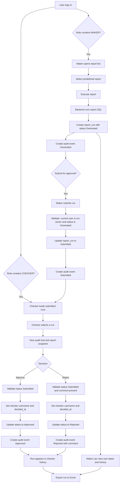

# Hackathon Report App Analysis

## Overview

This project is a full-stack reporting application built with:

- Spring Boot backend
- Angular frontend
- H2 in-memory database
- JWT-based authentication
- A maker-checker approval workflow for report runs

Its core purpose is to let users execute predefined analytical reports, persist each execution as a report run, submit runs for approval, and track every workflow step through an audit trail.

## 1. Project Structure

### Top-level structure

- `backend/`
  Spring Boot application containing authentication, report execution, approval workflow, audit, export, and database initialization.

- `frontend/`
  Angular application containing login, report browsing, maker submission UI, checker approval UI, and audit flow views.

- `README.md`
  High-level hackathon topic description.

- `Agent.md`
  Local project operating notes, default users, routes, and usage guidance.

### Backend structure

Key backend modules:

- `com.legacy.report.ReportApplication`
  Main Spring Boot entry point.

- `config/`
  - `SecurityConfig`: configures stateless Spring Security, CORS, JWT filter, and password encoder
  - `UserInitializer`: creates default users at startup if they do not exist

- `security/`
  - `JwtTokenProvider`: creates and validates JWT tokens
  - `JwtAuthenticationFilter`: extracts JWT from `Authorization` header and populates authenticated user context

- `controller/`
  - `AuthController`: login, profile, logout
  - `ReportController`: report listing, report execution, export, legacy SQL endpoints
  - `ReportRunController`: submit, approve/reject, run audit, run export

- `service/`
  - `AuthService`
  - `CurrentUserService`
  - `ReportService`
  - `ReportRunService`
  - `AuditService`
  - `ReportExcelExportService`

- `dao/`
  - `ReportDao`: JDBC data access for `report_config` and direct SQL execution

- `model/`
  - `User`
  - `Report`
  - `ReportRun`
  - `ReportAuditEvent`

- `repository/`
  - `UserRepository`
  - `ReportRunRepository`
  - `ReportAuditEventRepository`

- `resources/`
  - `application.yml`
  - `schema.sql`
  - `data.sql`
  - `report-templates/*.xlsx`

### Frontend structure

Key frontend modules:

- `src/app/app.routes.ts`
  Defines application routes:
  - `/login`
  - `/reports`
  - `/maker`
  - `/checker`
  - `/runs/:id/flow`

- `src/app/services/`
  - `auth.service.ts`: login/logout, token storage, current user storage
  - `auth.guard.ts`: authentication and role-based route guards
  - `auth.interceptor.ts`: attaches JWT token to outgoing API calls
  - `report.service.ts`: wraps report and report-run APIs

- `src/app/components/auth/`
  - `login.component.ts`

- `src/app/components/report/`
  - `report-viewer.component.ts`: main maker/checker UI
  - `report-run-flow.component.ts`: timeline view for a single run

## 2. Roles and Permission Flow

### Defined users and roles

The system initializes these users:

- `maker1 / 123456`
  Role: `MAKER`

- `checker1 / 123456`
  Role: `CHECKER`

- `admin / 123456`
  Role: `MAKER,CHECKER`

### Important role model note

There is no separate backend `ADMIN` authority model.

The `admin` user is actually a dual-role user that contains both `MAKER` and `CHECKER`. Authorization logic is based on checking whether the current user’s comma-separated role string contains the required role.

### Authentication flow

1. Frontend sends username and password to `POST /api/auth/login`
2. Backend validates credentials and returns:
   - JWT token
   - user DTO with username and role
3. Frontend stores token and user info in `localStorage`
4. Angular interceptor adds `Authorization: Bearer <token>` to API calls
5. Backend JWT filter validates the token and loads the authenticated username into the Spring Security context

### Authorization flow

#### Route-level checks in Angular

- `/reports`
  Any authenticated user

- `/maker`
  User must have `MAKER`

- `/checker`
  User must have `CHECKER`

#### Backend role enforcement

Backend role checks are mainly enforced in `CurrentUserService` and `ReportRunService`.

- `MAKER` can:
  - execute a predefined report and create a run
  - submit their own generated run
  - view their own run history
  - view their latest run for a report

- `CHECKER` can:
  - view submitted runs waiting for decision
  - approve or reject submitted runs
  - view their own checker history

- Any authenticated user can:
  - list reports
  - get report details
  - fetch run audit trail
  - call export endpoints

### Practical permission behavior

- **Maker**
  Can generate report runs and submit them for approval, but cannot decide approval results.

- **Checker**
  Can review submitted runs and decide approval or rejection, but cannot perform maker-only operations unless they also have maker role.

- **Admin**
  Since `admin` has both roles, admin can perform both maker and checker actions.

### Important workflow constraint

The code does not implement separation-of-duties between maker and checker when a user has both roles. Therefore, a dual-role user could generate and later approve the same run.

## 3. Business Workflow: Report Submission → Review → Approval / Rejection

### Core business entities

- **Report definition**
  Stored in `report_config`. This is the predefined report template and SQL definition.

- **Report run**
  Stored in `report_run`. This represents one execution instance of a predefined report.

- **Audit event**
  Stored in `report_audit_event`. This records workflow history for a report run.

### Report run statuses

A report run progresses through these statuses:

- `Generated`
- `Submitted`
- `Approved`
- `Rejected`

### End-to-end business flow

#### Step 1: Maker executes a predefined report

When the maker selects a report and executes it:

- frontend calls `POST /api/reports/{id}/execute`
- backend verifies current user has `MAKER`
- backend loads the report definition from `report_config`
- backend executes the report SQL
- backend creates a `report_run` record with:
  - report ID
  - report name snapshot
  - maker username
  - generated timestamp
  - status `Generated`
  - optional result snapshot JSON
- backend records audit event `Generated`

#### Step 2: Maker submits the run for approval

When the maker submits the current run:

- frontend calls `POST /api/report-runs/{id}/submit`
- backend verifies:
  - current user has `MAKER`
  - run exists
  - run status is `Generated`
  - current user is the same maker who created that run
- backend updates:
  - status → `Submitted`
  - `submitted_at`
- backend records audit event `Submitted`

#### Step 3: Checker reviews submitted runs

Checker loads the approval work queue through:

- `GET /api/report-runs/submitted`

Backend returns runs in `Submitted` status ordered by earliest submission time.

Checker can inspect a run’s workflow timeline through:

- `GET /api/report-runs/{id}/audit`

#### Step 4: Checker approves or rejects

Checker submits a decision through:

- `POST /api/report-runs/{id}/decision`

Payload contains:

- `decision`: `APPROVED` or `REJECTED`
- `comment`

Backend verifies:

- current user has `CHECKER`
- run exists
- run status is `Submitted`

Additional rule:

- rejection requires a non-empty comment

Then backend updates:

- `checker_username`
- `decided_at`
- `status`:
  - `Approved` when approved
  - `Rejected` when rejected

And backend records audit event:

- `Approved`
- or `Rejected` with comment

#### Step 5: History and export

- Maker can view their historical runs
- Checker can view their historical decisions
- Users can export report results or specific runs to Excel

### Workflow business rules

- Only a maker can generate a report run
- Only the same maker can submit their own generated run
- Only a checker can approve or reject a submitted run
- Only a submitted run can be decided
- Rejection requires a comment
- Audit events record each state transition

## 4. H2 Database Structure

### Database configuration

From `backend/src/main/resources/application.yml`:

- H2 in-memory database
- JDBC URL: `jdbc:h2:mem:reportdb`
- username: `sa`
- password: empty
- H2 console enabled
- schema/data initialized automatically at startup

This means all seeded business data resets when the backend restarts.

### Tables created in `schema.sql`

Business dataset tables:

- `customer`
  Stores customer master data such as type, status, registration date, credit score, and account balance.

- `transaction`
  Stores financial transactions linked to customers and merchants.

- `merchant`
  Stores merchant details and commission rates.

- `product`
  Stores product catalog, cost, price, and stock quantity.

- `orders`
  Stores order headers linked to customers.

- `order_items`
  Stores line items for orders linked to products.

- `department`
  Stores department structure, manager, location, and budget.

- `employee`
  Stores employees linked to departments.

- `report_config`
  Stores report definitions:
  - `name`
  - `sql`
  - `description`
  - `is_deleted`
  - `create_time`

### Tables created by JPA

Because `spring.jpa.hibernate.ddl-auto=update`, these application tables are created and maintained through JPA entities rather than `schema.sql`:

- `users`
- `report_run`
- `report_audit_event`

### Seed data in `data.sql`

The seed data provides:

- 5 customers
- 7 transactions
- 5 merchants
- 5 departments
- 5 employees
- 5 products
- 5 orders
- 8 order items
- 12 active reports
- 1 deleted legacy report

### Relationship summary

Core business relationships:

- `transaction.customer_id -> customer.id`
- `transaction.merchant_id -> merchant.id`
- `orders.customer_id -> customer.id`
- `order_items.order_id -> orders.id`
- `order_items.product_id -> product.id`
- `employee.department_id -> department.id`

Workflow relationships:

- `report_run.report_id` references a report definition in `report_config`
- `report_audit_event.report_run_id` references a report run
- `report_audit_event.report_id` stores the related report ID redundantly for easier querying

## 5. General Purpose of SQL Logic for Each Report

All report SQL is seeded into `report_config` by `data.sql`. These are predefined analytical queries over the demo H2 business dataset.

### Report 1: Customer Transaction Analysis

- Summarizes successful transactions by customer
- Calculates total amount, transaction count, average transaction amount, and includes customer type and credit score
- Business purpose: customer activity and value ranking

### Report 2: VIP Customer Revenue Report

- Focuses on VIP customers only
- Calculates income, expense, account balance, and net profit
- Business purpose: profitability analysis for high-value customers

### Report 3: Merchant Performance Analysis

- Aggregates successful merchant transactions
- Calculates transaction count, total volume, average amount, and estimated commission
- Business purpose: merchant ranking and commission estimation

### Report 4: Department Budget Analysis

- Compares department budget against active employee salary cost
- Calculates employee count, total salary cost, budget variance, and utilization percentage
- Business purpose: budget control and staffing cost analysis

### Report 5: Product Profitability Report

- Joins products with order items
- Calculates quantity sold, revenue, cost, profit, and profit margin
- Business purpose: product-level profitability analysis

### Report 6: Customer Segmentation Analysis

- Classifies customers based on transaction behavior
- Calculates income/expense counts and totals, then assigns value segments such as High Value, Medium Value, or Low Value
- Business purpose: customer segmentation and targeting

### Report 7: Monthly Revenue Trend Analysis

- Aggregates transaction metrics by transaction date
- Calculates transaction count, total income, and total expense per period
- Business purpose: trend analysis of revenue and expense activity

### Report 8: Order Fulfillment Analysis

- Aggregates orders by order date
- Calculates order count, total order value, and status distribution across completed, processing, and pending
- Business purpose: fulfillment pipeline monitoring

### Report 9: Employee Performance Metrics

- Joins employee and department data
- Calculates budget percentage per employee and salary tier classification
- Business purpose: workforce cost and compensation analysis

### Report 10: Customer-Merchant Revenue Matrix

- Joins customers, transactions, and merchants
- Calculates transaction count, total amount, average transaction, and merchant ranking per customer using window functions
- Business purpose: customer spending concentration and merchant affinity analysis

### Report 11: Inventory Velocity Analysis

- Combines product, order items, and orders data
- Calculates current stock, total sold, unit profit, and margin percentage
- Business purpose: inventory turnover and profitability monitoring

### Report 12: Financial Health Scorecard

- Uses `UNION ALL` to build KPI-style summary rows
- Calculates total revenue, total expenses, net profit, active customers, and average transaction value
- Business purpose: executive financial health dashboard

### Deleted legacy report

- `Legacy Customer Overview`
- SQL: `SELECT * FROM customer`
- Marked with `is_deleted = 1`
- Hidden from normal report listing

## Additional Observations

### What the system is designed to demonstrate

This application is not just a SQL report runner. It demonstrates:

- predefined governed reporting
- maker-checker approval workflow
- auditability of each report execution
- exportable report output
- a simple enterprise-style internal reporting process

### Where business logic lives today

- Workflow logic is implemented in Java services
- Report analytics logic still lives in SQL definitions inside `report_config`

This makes the project a good candidate for future refactoring if the goal is to migrate report calculation logic from SQL into Java.

### Notable limitations and risks

- No distinct admin authorization model beyond dual-role membership
- A dual-role user can potentially generate and approve the same run
- Legacy endpoints still expose direct or semi-dynamic SQL execution patterns
- Audit trail read access is broad for authenticated users

## Mermaid Business Flowchart

## Summary

This project is a Spring Boot + Angular reporting platform with predefined SQL reports over an H2 demo dataset. The main business capability is not only report execution, but also workflow governance:

- maker generates report runs
- maker submits runs for approval
- checker reviews and approves or rejects
- every state change is audited
- outputs can be exported to Excel

The H2 schema models customers, transactions, merchants, products, orders, departments, and employees. Report SQL performs analytical aggregation over those entities. Workflow persistence is handled separately through `report_run` and `report_audit_event` tables.
