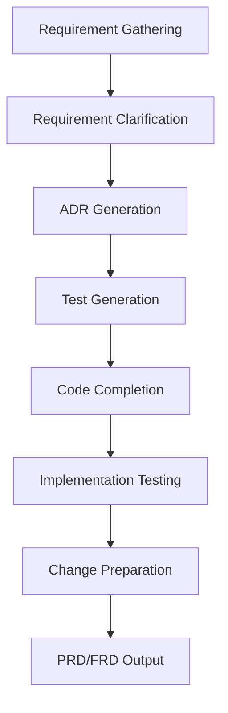

# Requirements-to-Delivery Workflow

## Overview

This document defines the end-to-end workflow for Topic 2 of the hackathon: taking a requirement from intake through clarification, architectural decision-making, test generation, implementation, validation, change packaging, and final PRD/FRD delivery.

The workflow is designed for the hackathon report app and emphasizes:

- AI-assisted delivery
- regression safety
- traceability from requirement to release artifact
- repeatable handoffs between stages
- security and quality gates before delivery

## Workflow Stages

| Stage | Goal | Primary Output | Typical Owner |
|------|------|------|------|
| Requirement Gathering | Capture stakeholder intent | Intake record | Product owner / analyst |
| Requirement Clarification | Convert ambiguity into actionable scope | Clarified requirement set | Analyst / engineering lead |
| ADR Generation | Record key technical choices | ADR documents | Architect / senior engineer |
| Test Generation | Define validation strategy and cases | Test plan and test cases | QA / engineer |
| Code Completion | Implement the approved requirement | Code changes | Engineer |
| Implementation Testing | Validate delivered behavior | Test evidence | Engineer / QA |
| Change Preparation | Package the release candidate | Change package | Engineer / release owner |
| PRD/FRD Output | Deliver final business and functional artifact | PRD or FRD | Product / engineering |

## End-to-End Flow

## Stage Handoffs

### 1. Gathering to Clarification

Required handoff artifacts:

- stakeholder request summary
- business objective
- known constraints
- open questions
- success indicators

### 2. Clarification to ADR

Required handoff artifacts:

- clarified scope
- acceptance criteria
- assumptions
- non-goals
- architectural pressure points

### 3. ADR to Test Generation

Required handoff artifacts:

- approved technical direction
- affected components
- integration boundaries
- quality risks

### 4. Test Generation to Code Completion

Required handoff artifacts:

- test plan
- required regression suites
- test data assumptions
- blocking risks

### 5. Code Completion to Implementation Testing

Required handoff artifacts:

- delivered code diff
- impacted modules list
- local run instructions
- expected behavioral outcomes

### 6. Testing to Change Preparation

Required handoff artifacts:

- test results summary
- unresolved risks
- screenshots or logs if needed
- deployment or rollout considerations

### 7. Change Preparation to PRD/FRD Output

Required handoff artifacts:

- implementation summary
- evidence bundle
- final scope statement
- known limitations

## AI Assistance Model

| Stage | AI Assistance |
|------|------|
| Requirement Gathering | Draft intake template, summarize stakeholder notes, normalize terminology |
| Requirement Clarification | Generate clarification questions, rewrite requirements into atomic statements |
| ADR Generation | Compare options, draft decision records, capture tradeoffs |
| Test Generation | Produce test matrices, acceptance tests, regression candidates |
| Code Completion | Scaffold code, suggest refactors, map requirements to modules |
| Implementation Testing | Interpret failures, identify likely root causes, summarize validation evidence |
| Change Preparation | Assemble release notes, traceability links, checklist completion |
| PRD/FRD Output | Consolidate the final business and functional narrative |

## Control Hooks

Recommended control hooks across the workflow:

- secret scanning
- SQL injection checks
- dependency vulnerability review
- changelog verification
- traceability validation
- required test gate enforcement

## Completion Criteria

This workflow is complete when:

- each stage has produced its required artifact
- traceability from requirement to test evidence is preserved
- major technical decisions are documented in ADRs
- implementation is validated with regression-aware testing
- the final PRD or FRD reflects delivered behavior and constraints
